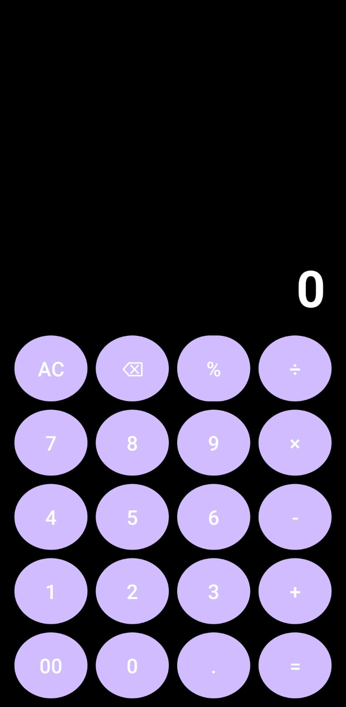
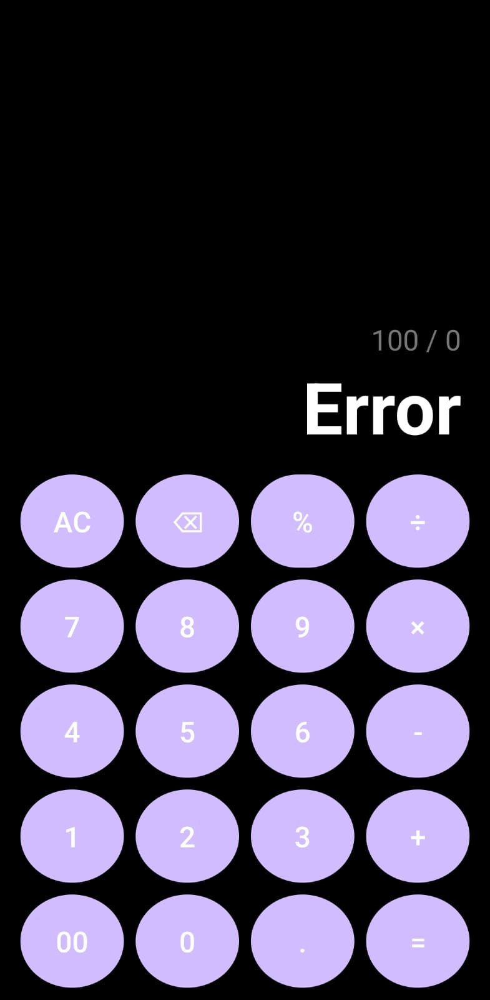

# SimpleCalculator Android

A modern calculator app built using Kotlin and Android Studio.

Inspired by Samsung One UI design.

## Features

- Addition, subtraction, multiplication and division
- Percentage calculation
- Decimal support
- Continuous calculations
- Delete and clear functions
- AMOLED dark theme
- Smooth button animations

## Screenshots

## Tech Stack

- Kotlin
- Android Studio
- XML
- Material Design

## Download APK

Check the Releases section for APK.

## Developer

Khan Mohammad Shafi
